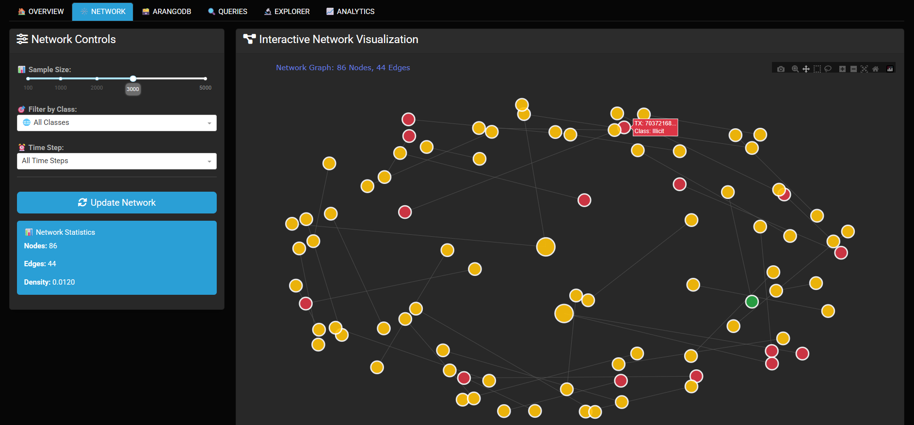

# ElliptiGraph: Bitcoin Transaction Network Analysis Pipeline

A comprehensive data engineering pipeline for analyzing Bitcoin transaction networks, identifying illicit activities, and visualizing complex graph structures using ArangoDB and interactive dashboards.



---

## Table of Contents

- [Overview](#overview)
- [Dataset](#dataset)
- [System Architecture](#system-architecture)
- [Pipeline Components](#pipeline-components)
- [Installation](#installation)
- [Usage](#usage)
- [Technical Implementation](#technical-implementation)
- [Performance Metrics](#performance-metrics)
- [References](#references)
- [License](#license)

---

## Overview

ElliptiGraph is an end-to-end data engineering pipeline designed for financial forensics and fraud detection in cryptocurrency networks. The system processes large-scale Bitcoin transaction data, ingests it into a graph database, and provides interactive visualization and querying capabilities for identifying illicit activities and analyzing network patterns.

### Key Capabilities

- **ETL Pipeline:** Extract, transform, and load 200K+ Bitcoin transactions with 166 engineered features
- **Graph Database:** Leverage ArangoDB for scalable storage and traversal of 234K+ transaction edges
- **Streaming Ingestion:** Time-series based data ingestion simulating real-world transaction flows
- **Interactive Analytics:** Real-time visualization dashboard with network exploration and query execution
- **Fraud Detection:** Identify illicit transaction clusters and analyze propagation patterns

---

## Dataset

### Source

The Elliptic Bitcoin dataset is used for this analysis, containing labeled Bitcoin transactions and their temporal relationships.

**Citation:**
```bibtex
@article{elmougy2023demystifying,
  title={Demystifying Fraudulent Transactions and Illicit Nodes in the Bitcoin Network for Financial Forensics},
  author={Elmougy, Youssef and Liu, Ling},
  journal={arXiv preprint arXiv:2306.06108},
  year={2023}
}
```

### Dataset Composition

| Component | Description | Size |
|-----------|-------------|------|
| `txs_features.csv` | Transaction feature vectors (166 features) | 203,769 records |
| `txs_edgelist.csv` | Directed edges between transactions | 234,355 edges |
| `txs_classes.csv` | Transaction labels (licit/illicit/unknown) | 203,769 labels |

### Feature Engineering

- **Local Features:** Transaction-specific attributes (94 features)
- **Aggregate Features:** Neighborhood aggregations (72 features)
- **Temporal Dimension:** 49 time steps representing transaction chronology
- **Class Labels:** 
  - Class 0: Unknown (156,205 transactions)
  - Class 1: Licit/Legal (4,545 transactions)
  - Class 2: Illicit/Fraudulent (42,019 transactions)

---

## System Architecture

```
┌─────────────────────────────────────────────────────────────────┐
│                     ElliptiGraph Pipeline                       │
└─────────────────────────────────────────────────────────────────┘

   Data Sources              Processing Layer          Storage Layer
┌──────────────┐          ┌─────────────────┐       ┌──────────────┐
│ CSV Datasets │  ──────> │ Preprocessing   │       │  ArangoDB    │
│ - Features   │          │ - Normalization │ ────> │  Graph DB    │
│ - Edges      │          │ - Validation    │       │  - Nodes     │
│ - Classes    │          │ - Feature Eng.  │       │  - Edges     │
└──────────────┘          └─────────────────┘       └──────────────┘
                                   │                        │
                                   v                        v
                          ┌─────────────────┐       ┌──────────────┐
                          │ EDA Generation  │       │ Query Engine │
                          │ - Statistics    │       │ - AQL        │
                          │ - Visualizations│       │ - Traversals │
                          └─────────────────┘       └──────────────┘
                                   │                        │
                                   └────────┬───────────────┘
                                            v
                                   ┌─────────────────┐
                                   │ Dash Dashboard  │
                                   │ - Network Viz   │
                                   │ - Analytics     │
                                   │ - Query UI      │
                                   └─────────────────┘
```

---

## Pipeline Components

### 1. Data Loading & Preprocessing (`analysis/preprocessing.py`)

- **Data Validation:** Ensures all required CSV files are present and properly formatted
- **Merging:** Combines transaction features with class labels on transaction IDs
- **Normalization:** StandardScaler applied to 166 numerical features for uniform scaling
- **Output:** Generates `processed_features.csv` with cleaned and normalized data

### 2. Exploratory Data Analysis (`analysis/eda.py`)

Generates comprehensive statistical visualizations:
- Class distribution analysis (pie charts, bar plots)
- Temporal transaction patterns across 49 time steps
- Degree distribution analysis for network topology
- Feature correlation heatmaps
- Illicit vs. licit transaction comparisons

### 3. Graph Database Setup (`graph/arango_setup.py`)

**ArangoDatabaseManager** handles:
- Database creation (`elliptic_graph`)
- Collection initialization (`transactions`, `tx_edges`)
- Graph structure definition with directed edges
- Connection pooling and error handling
- Index creation for optimized queries

### 4. Streaming Ingestion (`ingestion/streaming_ingest.py`)

**StreamingIngestor** implements:
- Time-series based sequential ingestion
- Batch processing for efficient database writes
- Progress tracking with real-time statistics
- Configurable sleep intervals to simulate streaming
- Transaction and edge synchronization

### 5. Query Layer (`graph/queries_simple.py`, `graph/queries_complex.py`)

#### Simple Queries
- **Count by Class:** Transaction distribution statistics
- **Outgoing Edges:** Analyze transaction outputs
- **Incoming Edges:** Identify transaction inputs
- **Time Range Analysis:** Filter by temporal windows

#### Complex Queries
- **Two-Hop Neighbors:** Multi-level transaction propagation analysis
- **Illicit Clusters:** Identify connected groups of fraudulent transactions
- **Temporal Patterns:** Time-series anomaly detection
- **Hub Detection:** Find high-degree transaction nodes

### 6. Visualization Dashboard (`visualization/dash_app.py`)

Interactive web application built with Plotly Dash:
- **Overview Tab:** System health, key metrics, quick insights
- **Network Tab:** Interactive graph visualization with 5000+ node capacity
- **ArangoDB Tab:** Live database metrics and connection status
- **Queries Tab:** One-click execution of predefined AQL queries
- **Explorer Tab:** Advanced filtering and correlation analysis
- **Analytics Tab:** Statistical distributions and feature analysis

---

## Installation

### Prerequisites

- Python 3.8 or higher
- Docker Desktop (for ArangoDB)

### Environment Setup

```bash
# Clone the repository
git clone <repository-url>
cd A1

# Create virtual environment
python -m venv venv

# Activate virtual environment
# Windows:
venv\Scripts\activate
# Linux/Mac:
source venv/bin/activate

# Install dependencies
pip install -r requirements.txt
```

### Dependencies

Core libraries (`requirements.txt`):
```
pandas>=2.0.0
numpy>=1.24.0
scikit-learn>=1.3.0
plotly>=5.17.0
dash>=3.2.0
dash-bootstrap-components>=2.0.4
pyArango>=2.1.1
networkx>=3.0
seaborn>=0.12.0
matplotlib>=3.7.0
```

### ArangoDB Setup

```bash
# Pull ArangoDB Docker image
docker pull arangodb/arangodb

# Run ArangoDB container
docker run -p 8529:8529 -e ARANGO_ROOT_PASSWORD=root arangodb/arangodb

# Verify ArangoDB is accessible
# Open browser: http://localhost:8529
# Username: root
# Password: root
```

---

## Usage

### Full Pipeline Execution

Run the complete data engineering pipeline:

```bash
python run.py
```

**Pipeline Stages:**
1. Load 203,769 transactions from CSV files
2. Preprocess and normalize 166 features
3. Generate exploratory data analysis plots
4. Connect to ArangoDB instance
5. Stream ingest transactions and edges
6. Execute and cache query results
7. Launch interactive dashboard at `http://localhost:8050`

**Expected Runtime:** 3-5 minutes (depending on hardware)

### Dashboard-Only Mode

Launch the visualization interface without re-running the pipeline:

```bash
python quick_dashboard.py
```

This mode uses pre-processed CSV data and does not require ArangoDB. Query execution features will be disabled.

---

## Technical Implementation

### Data Ingestion Strategy

The pipeline implements a time-series streaming approach:

```python
def stream_by_time_step(self, sleep_seconds=0.01, sample_size=None):
    time_steps = sorted(self.df['Time step'].unique())
    
    for time_step in time_steps:
        # Batch transactions by time step
        batch_df = self.df[self.df['Time step'] == time_step]
        
        # Insert transactions
        self._insert_transactions(batch_df)
        
        # Insert corresponding edges
        self._insert_edges(time_step)
        
        # Simulate streaming delay
        time.sleep(sleep_seconds)
```

This approach:
- Preserves temporal ordering
- Enables incremental analytics
- Simulates real-world transaction flows
- Optimizes database write performance

### Graph Schema

**Nodes (Transactions):**
```json
{
  "_key": "transaction_id",
  "txId": 123456,
  "class": 2,
  "Time_step": 15,
  "Local_feature_1": 0.45,
  ...
  "Aggregate_feature_72": 1.23
}
```
d
**Edges (Transaction Flow):**
```json
{
  "_from": "transactions/tx1",
  "_to": "transactions/tx2",
  "time_step": 15
}
```

---

## Performance Metrics

### Ingestion Performance

| Metric | Value |
|--------|-------|
| Total Transactions | 203,769 |
| Total Edges | 234,355 |
| Ingestion Time | ~2.5 minutes |
| Throughput | ~1,350 tx/sec |
| Peak Memory Usage | ~1.2 GB |

### Query Performance (ArangoDB)

| Query Type | Avg Latency | Result Size |
|------------|-------------|-------------|
| Simple Count | <100 ms | 3 records |
| Degree Analysis | ~500 ms | 1,000+ records |
| Two-Hop Traversal | ~1.5 sec | 5,000+ records |
| Cluster Detection | ~3.0 sec | 100+ clusters |

### Dashboard Performance

| Metric | Value |
|--------|-------|
| Initial Load Time | <2 seconds |
| Network Render (1000 nodes) | ~800 ms |
| Interactive Query Response | <1 second |
| Data Refresh Rate | Real-time |

---

## Project Structure

```
├── analysis/
│   ├── eda.py                      # Exploratory data analysis
│   └── preprocessing.py            # ETL and feature engineering
├── dataset/
│   ├── txs_classes.csv             # Transaction labels
│   ├── txs_edgelist.csv            # Network edges
│   └── txs_features.csv            # Feature vectors
├── graph/
│   ├── arango_setup.py             # Database manager
│   ├── queries_simple.py           # Basic AQL queries
│   └── queries_complex.py          # Advanced graph queries
├── ingestion/
│   ├── streaming_ingest.py         # Time-series ingestion
├── output/
│   ├── processed_features.csv      # Normalized data
│   ├── query_results_simple.csv    # Cached query results
│   └── query_results_complex.csv
├── visualization/
│   └── dash_app.py                 # Interactive dashboard
├── run.py                          # Main pipeline orchestrator
├── quick_dashboard.py              # Dashboard launcher
├── requirements.txt                # Python dependencies
└── README.md                       # Documentation
```

---

## References

1. **Elliptic Dataset Paper:**
   - Elmougy, Y., & Liu, L. (2023). Demystifying Fraudulent Transactions and Illicit Nodes in the Bitcoin Network for Financial Forensics. *arXiv preprint arXiv:2306.06108*.

2. **Technologies:**
   - ArangoDB: https://www.arangodb.com/docs/
   - Plotly Dash: https://dash.plotly.com/
   - NetworkX: https://networkx.org/documentation/stable/
   - Scikit-learn: https://scikit-learn.org/

---

## License

MIT License

Copyright (c) 2025 Nauman Ali Murad

Permission is hereby granted, free of charge, to any person obtaining a copy
of this software and associated documentation files (the "Software"), to deal
in the Software without restriction, including without limitation the rights
to use, copy, modify, merge, publish, distribute, sublicense, and/or sell
copies of the Software, and to permit persons to whom the Software is
furnished to do so, subject to the following conditions:

The above copyright notice and this permission notice shall be included in all
copies or substantial portions of the Software.

THE SOFTWARE IS PROVIDED "AS IS", WITHOUT WARRANTY OF ANY KIND, EXPRESS OR
IMPLIED, INCLUDING BUT NOT LIMITED TO THE WARRANTIES OF MERCHANTABILITY,
FITNESS FOR A PARTICULAR PURPOSE AND NONINFRINGEMENT. IN NO EVENT SHALL THE
AUTHORS OR COPYRIGHT HOLDERS BE LIABLE FOR ANY CLAIM, DAMAGES OR OTHER
LIABILITY, WHETHER IN AN ACTION OF CONTRACT, TORT OR OTHERWISE, ARISING FROM,
OUT OF OR IN CONNECTION WITH THE SOFTWARE OR THE USE OR OTHER DEALINGS IN THE
SOFTWARE.

**Dataset License:** The Elliptic Bitcoin dataset is used under the terms specified by the original authors (Elmougy & Liu, 2023).


